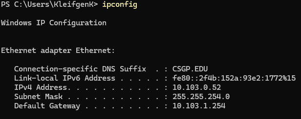

# The Pokemaniacs Multiplayer Tag Game

## Description
This project is a multiplayer tag game implemented in Python using `pygame` for the game interface and `socket` for network communication. The game allows multiple players to connect to a server and play a game of tag with some fun powerups on a randomly generated map.

## Installation
1. Clone the repository:
    ```sh
    git clone https://github.com/yourusername/multiplayer-tag-game.git
    cd multiplayer-tag-game
    ```

2. Install the required dependencies:
    ```sh
    pip install pygame
    ```

## Usage
### Running the Server
1. Start the server:
    ```sh
    python server.py
    ```
2. Enter the port number when prompted. 

    EX... 8000

### Running the Client
1. Start the client:

    A. Open terminal and `cd` into the directory 

    b. Enter your IP address in when propted 
    (if you dont know wht it is open up a new window in the terminal and `ipconfig`)
    

    
2. Enter the server IP and port number when prompted.

## Features
- **Random Map Generation**: The map is randomly generated with rooms and hallways.
- **Multiplayer Support**: Any number of clients can connect to the server and play the game.
- **Power-ups**: Players can collect power-ups that provide temporary abilities.

## File Structure
- [client.py](http://_vscodecontentref_/1): Handles the client-side logic, including connecting to the server, receiving the map, and sending player data.
- [server.py](http://_vscodecontentref_/2): Manages client connections, broadcasts game state, and handles game logic on the server side.
- [game.py](http://_vscodecontentref_/3): Contains the `Game` and `Player` classes, which manage the game state, player movement, and rendering.
- [map.py](http://_vscodecontentref_/4): Generates the game map with rooms and hallways.
- [powerup.py](http://_vscodecontentref_/5): Manages power-ups that players can collect during the game.
- [test.py](http://_vscodecontentref_/6): A test script for generating and printing the map.

## Code Explanation

### [client.py](http://_vscodecontentref_/11)
- **Connecting to Server**: Establishes a connection to the server using sockets.
- **Receiving Map Data**: Receives the map data from the server and initializes the game.
- **Sending Player Data**: Sends player movement and actions to the server.
- **Game Loop**: Handles the main game loop, including event handling, updating game state, and rendering.

### [server.py](http://_vscodecontentref_/12)
- **Client Connections**: Listens for incoming client connections and handles them in separate threads.
- **Broadcasting Game State**: Continuously sends the updated game state to all connected clients.
- **Game Logic**: Manages the overall game logic, including player interactions and game rules.

### [game.py](http://_vscodecontentref_/13)
- **Game Class**: Manages the overall game state, including the map, players, and power-ups.
- **Player Class**: Represents a player in the game, including position, movement, and state.
- **Rendering**: Handles rendering the game state to the screen using `pygame`.

### [map.py](http://_vscodecontentref_/14)
- **Map Generation**: Generates a random map with rooms and hallways.
- **Tile Management**: Manages the individual tiles that make up the map.

### [powerup.py](http://_vscodecontentref_/15)
- **Power-up Management**: Manages the power-ups that players can collect during the game.
- **Power-up Effects**: Defines the effects of different power-ups on players.

### [test.py](http://_vscodecontentref_/16)
- **Map Testing**: Generates a map and prints it to the console for testing purposes.

## Configuration
- **Map Size**: The map size can be configured in the `Game` class in [game.py](http://_vscodecontentref_/17).
- **Player Speed**: Player speed and other attributes can be configured in the `Player` class in [game.py](http://_vscodecontentref_/18).

## Running the Tests
1. Run the test script:
    ```sh
    python test.py
    ```

## Contributions
1. Cameron Byliu

2. Zedrik Hoover

3. Koen Kleifgen


